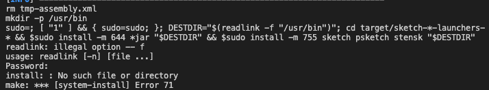

# autograder-jipm
Jiwon Lee
Parker Mitchell

We found this paper very interesting, and at-a-glance, much more approachable and digestable for us. The concept and technologies used were very interesting, and provided a very tangible application of SAT/SMT solvers for us to see.

We first started by just reading the full paper and getting a better grasp of what was going on. Following this, and thanks to some helpful pointers on Piazza, we used [Armando Solar-Lezama's build guide](https://github.com/asolarlez/sketch-frontend/wiki) for Sketch to try and install all the dependencies we needed to run Sketch. After installing for about 20 minutes, we tried to fully make Sketch, but ran into an issue we were not able to solve, namely this:
 

Since we could not build and run Sketch, we focused on getting things working prior to running Sketch. So we started by creating a sample Python file with a simple function to act as the "student's submission", and generated a "rules.eml" file to server as our error model.

We wrote generateMPY function that generated MPy files to feed to sketch translator based on our EML rules. The function takes the expression to work one and assumes  it's in correct syntax. For the simplicity, our rule in the function was to simply leave the code as is, add 1, or subtract 1. This was for the proof of the concept to get the sketch working. 
